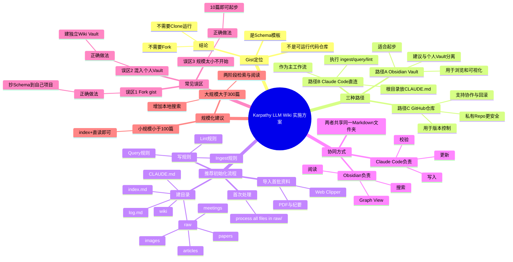

# Karpathy LLM Wiki 使用脑图

```mermaid
mindmap
  root((Karpathy LLM Wiki 实施方案))
    Gist定位
      是Schema模板
      不是可运行代码仓库
      结论
        不需要Fork
        不需要Clone运行
    三种路径
      路径A Obsidian Vault
        适合起步
        用于浏览和可视化
        建议与个人Vault分离
      路径B Claude Code直连
        作为主工作流
        根目录放CLAUDE.md
        执行 ingest/query/lint
      路径C GitHub仓库
        用于版本控制
        私有Repo更安全
        支持协作与回滚
    推荐初始化流程
      建目录
        raw
          articles
          papers
          meetings
          images
        wiki
        index.md
        log.md
        CLAUDE.md
      写规则
        Ingest规则
        Query规则
        Lint规则
      导入首批资料
        Web Clipper
        PDF与纪要
      首次处理
        process all files in raw/
    协同方式
      Obsidian负责
        阅读
        Graph View
        搜索
      Claude Code负责
        写入
        更新
        校验
      两者共享同一Markdown文件夹
    常见误区
      误区1 Fork gist
        正确做法
          抄Schema到自己项目
      误区2 混入个人Vault
        正确做法
          建独立Wiki Vault
      误区3 规模太小不开始
        正确做法
          10篇即可起步
    规模化建议
      小规模小于100篇
        index+直读即可
      大规模大于300篇
        增加本地搜索
        两阶段检索与阅读
```
